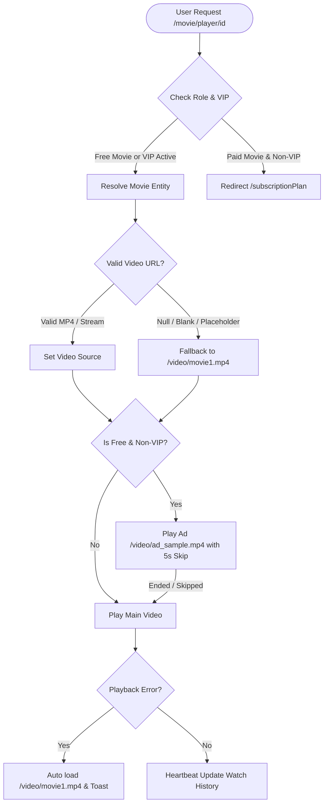

# Architecture

## Current Architecture

### Frontend
- **HTML/Thymeleaf**: Views are rendered on the server using Thymeleaf templates (e.g., `index`, `search`, `movie/player`, `movie/movie-detail`).
- **JavaScript Modules**: Vanilla JS scripts manage UI logic (`script.js`, `search.js`, `movie/player.js`, `movie/movie-detail.js`).
- **CSS**: Custom vanilla CSS with responsive design system (`style.css`, `movie-detail.css`, `footer.css`).
- **Browser-Side API Calls**: The frontend calls internal backend endpoints (e.g., `/api/movie/hover-detail/{id}`, `/api/movie/home/new`) instead of calling external services directly.

#### UI State & Circular Carousel Pattern
- **Circular Infinite Carousel Engine**:
  - Implements DOM element recycling to achieve continuous circular scrolling in both directions without clone explosion.
  - **Next Navigation**: Computes responsive `shiftCount` based on container width (`Math.floor(containerWidth * 0.8 / cardWidth)`). Applies smooth `translateX(-actualShift)` transition, then physically shifts the leading cards to the tail via `appendChild()`, resetting `transform` to `0` instantly without transition.
  - **Prev Navigation**: Pre-inserts trailing elements to the front via `insertBefore()`, applies an instant negative `translateX`, forces browser reflow, and smoothly translates back to `0`.
  - **Boundary & Containment**: Container sets `overflow: hidden;` with vertical padding (`10px 50px 25px`) to accommodate hover enlargement (`scale(1.05) translateY(-5px)`) without clipping or horizontal page blowout.
- **Micro-Interactions & Hover Experience**:
  - Description toggle chevron uses translucent glassmorphism (`rgba(255,255,255,0.25)`) instead of jarring accent red, preserving cinematic immersion.
  - Active header navigation state uses strict font-weight hierarchy (`font-weight: 800` vs `500`) with glow text-shadow for immediate orientation.
- **Asynchronous Skeleton Shimmer**:
  - High-latency data sets (e.g., TMDB trending, recommendations) render lightweight pulse skeletons immediately, eliminating First Contentful Paint bottlenecks.

### Backend
- **Controllers**: Standard Spring MVC controllers for SSR views and `@RestController`s (`MovieApiController`, `AISearchController`) for JSON endpoints.
- **Services**: Business logic encapsulated in `@Service` classes (`MovieService`, `MoviePlayerService`, `SubscriptionService`, `WatchHistoryService`).
- **Repositories**: Spring Data JPA repositories with native and JPQL queries for SQL Server.
- **Entities**: JPA Entities mapping directly to SQL Server `FFilm3` database. Internal primary key reference is consistently `movieID` (not external `tmdbId`).

#### Performance & Caching Strategy
- **Elimination of N+1 & Full-Table Scans**:
  - Replaced legacy `findAll()` scans with indexed candidate queries (`findHotCandidates()`) utilizing explicit `LEFT JOIN FETCH m.genres` and `PageRequest.of(0, limit)`.
  - Dramatically cut Home/Discover initial load latency from **25.6s down to ~0.4s**.
- **Memory Footprint & Transaction Isolation**:
  - Detached entities mapped to thread-safe Maps (`convertToMap()`) within `@Transactional(readOnly = true)` boundaries to completely prevent `LazyInitializationException`.
  - Query results for stable catalog data (e.g., genres, categories) cached in-memory (`spring.cache.type=simple`).

### External API Integrations (Data Flow)
**TMDB (The Movie Database):**
- *CURRENT*: `Browser → FFilm Backend → TMDB`
- TMDB requests are routed securely via Backend APIs. The API key is securely injected using `@Value("${tmdb.api.key}")`.

**Gemini AI:**
- *CURRENT*: `Browser → FFilm Backend (AIAgentService / AISearchService) → Gemini`
- Used for AI search processing and conversational AI. The API key is sourced from `@Value("${gemini.api.key:}")`.

**Tenor (Stickers):**
- *CURRENT*: `Browser → FFilm Backend (TenorController) → Tenor API`
- Used for chat stickers in Watch Party and Messenger. The API key is sourced from `@Value("${tenor.api.key}")` and securely proxied.

#### Video Playback & Fallback Mechanism

- **Guaranteed Playback Resolution**:
  - `MoviePlayerController` and `MoviePlayerService` implement multi-tier fallback: `findById` → `findByTmdbId` → First DB Movie → In-memory Mock Movie with `/video/movie1.mp4`.
  - Unhandled exceptions are caught and suppressed with resilient fallback objects so users NEVER encounter a blocking 404 page.
- **Client-Side Automatic Recovery**:
  - `movie/player.js` listens to video and source error events. If primary stream fails, it dynamically switches source to `/video/movie1.mp4` with toast notification before displaying retry modal.
- **Non-blocking Watch History & Resume**:
  - Watch progress is saved via `keepalive` fetch beacons on pause/unload and every 10s heartbeat.
  - Resume timestamps are queried via `findFirstByUserAndMovieOrderByLastWatchedAtDesc` wrapped in fail-safe try-catches.

### Database
- **Engine**: SQL Server (`FFilm3`)
- **Core Entities**:
  - `Users` table (Contains `isPublicFavorites`, `isPublicFriendList`, `isPublicWatchHistory` columns as nullable bits).
  - `Movie` table (Primary internal ID is `movieID`, external reference `tmdbId`, `trailerKey`).
  - `WatchHistory`, `UserSubscription`, `SubscriptionPlan`, `Payment`.

## Target / Future Architecture
- Migration to full backend-proxied external requests is currently partially implemented (TMDB has been re-routed; AI requests are properly proxied).
- The future architecture aims to fully detach all third-party secrets from any frontend code.
